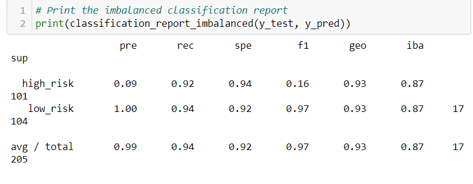

# Credit_Risk_Analysis

Supervised Machine Learning

## Overview

The purpose of this analysis was to learn and understand how to use Machine Learning statistical algorithims to make predictions based on the patterns we were provided. Credit risk is an inherently unbalanced classification problem, as good loans easily outnumber risky loans. In this challenege, different techniques were employed to train and evaluate models with unbalanced classes. Different libraries were used such as imbalanced-learn and scikit-learn to build and evaluate these models using resampling.

Using the credit card credit dataset from LendingClub, the following models were used with various Machine Learning algorithims such as, RandomOverSampler, SMOTE, ClusterCentroids, and SMOTEENN, BalancedRandomForestClassifier, and EasyEnsembleClassifier. These were used to balance out the classifications in order to allow room for more meaningful predictions and improve the accuracy score.

## Results

Before resampling the training data, we created the training variables by converting the string values into numerical ones usig the get_dummies() method. We also created the target values and checked the balance of the target values using loan_status.

The results of all six machine learning models are listed below. Included with the models is a description of the balanced accuracy score, as well as the precision and recall scores of the models.

## Oversampling

In this section, two oversampling algorithims were compared to determine which algorithim results in the best performance.

### Naive Random Oversampling

Balanced Accuracy Score: 0.6614329112986135
Precision Score:
    High Risk- 0.01
    Low Risk- 1.00
Recall Score: 
    High Risk- 0.62
    Low Risk- 0.69

### SMOTE Oversampling

Balanced Accuracy Score: 0.6581159869962674
Precision Score:
    High Risk- 0.01
    Low Risk- 1.00
Recall Score: 
    High Risk- 0.62
    Low Risk- 0.69

## Undersampling

In this section, an undersampling algorithin was tested to determine which algorithim results in the best performance compared to the oversampling algorithims above. This was done using the Cluter Centroids algorithim.

Balanced Accuracy Score: 0.5442661782548694
Precision Score:
    High Risk- 0.01
    Low Risk- 1.00
Recall Score: 
    High Risk- 0.69
    Low Risk- 0.40

## Combination (Over and Under) Sampling

In this section, a combination over- and under-sampling algorithim was tested to determine if the algorithim results in the best performance compared to the other sampling algorithims above. The data was resampled using the SMOTEENN algorithim, Counter from the collections library and imbalanced_classification_report from imbalanced-learn.

Balanced Accuracy Score: 0.6449163069955265
Precision Score:
    High Risk- 0.01
    Low Risk- 1.00
Recall Score: 
    High Risk- 0.72
    Low Risk- 0.57

### Ensemble Learners

In this section, two ensemble algorithims were compared to determine which algorithim results in the best performance. 

## Balanced Random Forest Classifier

Balanced Accuracy Score: 0.7885466545953005
Precision Score:
    High Risk- 0.03
    Low Risk- 1.00
Recall Score: 
    High Risk- 0.70
    Low Risk- 0.87

## Easy Ensemble AdaBoost Classifier

Balanced Accuracy Score: 0.7885466545953005
Precision Score:
    High Risk- 0.03
    Low Risk- 1.00
Recall Score: 
    High Risk- 0.70
    Low Risk- 0.87

## Summary

In summary, the Ensemble Learners; Balanced Random Forest Classifier and the Easy Ensemble AdaBoost Classifier have shown the highest accuracy between zero and one and is closest to one. This means that they would be the best machine learning model. The other models showed accuracy below .70. The precision for all models were .03 or .01 for high risk, and all were 1 for low risk. The Ensemble Learner models also had the better scores for recall, which were .70 for high risk and .87 for low risk. Since they both had the highest scores, this proves that they would be the best machine learning models to choose for further credit and credit card analysis with Lending Club.